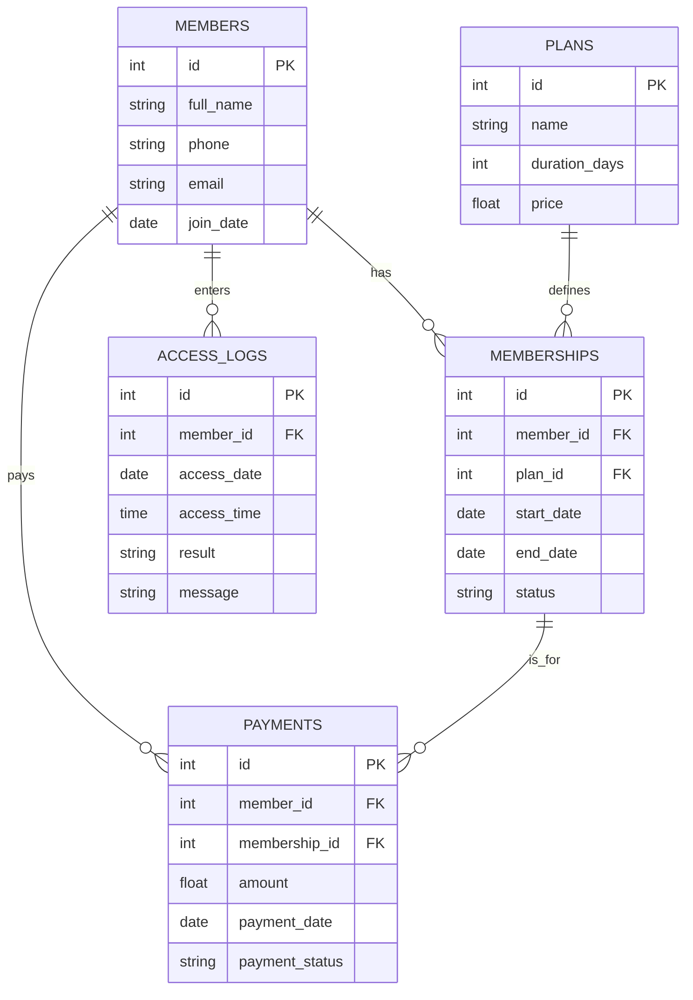

# Database Schema Diagram

This diagram represents the relational structure of the Sports Club Management System.

## Special Views

- **active_members_view**: Combines Members and Memberships to provide real-time access status (Allowed/Denied).
- **monthly_revenue_view**: Aggregates payment amounts by month for financial reporting.
